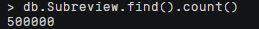

## 任务一：MongoDB实验

### 启动
```js
// 命令行启动mongod服务
mongod --dbpath /var/lib/mongodb/ --logpath /var/log/mongodb/mongodb.log --logappend &

// 使用MangoDB
mongo

// 使用yelp数据库
use yelp
```

### 1-1
#### 题目
查询review集合的2条数据，跳过第1条和第2条

#### 解析
使用了`skip()`方法跳过前两条数据，然后使用`limit()`方法来限制结果集的大小为2。如果review集合中有少于4条数据，则返回所有匹配的数据。

```js
db.review.find().skip(2).limit(2)
```


### 1-2
#### 题目
查询business集合中city是Goodyear的5条数据。

#### 解析
`db.business`表示选择business集合；`{ city: "Goodyear" }`是查询条件，表示选择city字段等于Goodyear的文档；`.limit(5)`表示限制返回的文档数量为5条。

```js
db.business.find({ city: "Goodyear" }).limit(5)
```


### 1-3
#### 题目
查询user集合中name是Tanya的user，只需要返回useful和cool,限制10条数据。

#### 解析
`db.user`表示选择user集合；`{ name: "Tanya" }`是查询条件，表示选择name字段等于Tanya的文档；`{ _id: 0, useful: 1, cool: 1 }`表示仅返回useful和cool字段，同时将_id字段排除在外；`.limit(10)`表示限制返回的文档数量为10条。
```js
db.user.find({ name: "Tanya" }, { _id: 0, useful: 1, cool: 1 }).limit(10)
```


### 1-4
#### 题目
查询user集合中funny位于[82，83，84]的user，只需返回name和funny，限制20条数据。

#### 解析
`db.user`表示选择user集合；`{ funny: { $in: [82, 83, 84] } }`是查询条件，表示选择funny字段值在数组[82, 83, 84]中的文档；`{ _id: 0, name: 1, funny: 1 }`表示仅返回name和funny字段，同时将_id字段排除在外；`.limit(20)`表示限制返回的文档数量为20条。

```js
db.user.find({ funny: { $in: [82, 83, 84] } }, { _id: 0, name: 1, funny: 1 }).limit(20)
```


### 1-5
#### 题目
查询user集合中5≤cool<10且useful≥20的user，限制10条。

#### 解析
`db.user`表示选择user集合；`{ cool: { $gte: 5, $lt: 10 }, useful: { $gte: 20 } }`是查询条件，表示选择cool字段值大于等于5且小于10，且useful字段值大于等于20的文档；`.limit(10)`表示限制返回的文档数量为10条。

```js
db.user.find({ cool: { $gte: 5, $lt: 10 }, useful: { $gte: 20 } }).limit(10)
```


### 1-6
#### 题目
统计business一共有多少条数据，并使用explain查询执行计划，了解MongoDB对集函数的执行方式。

#### 解析
先统计，再用`.explain("executionStats")`查询MongoDB对`count()`命令的执行计划

```js
db.business.count()
> 192609
db.business.explain("executionStats").count()
```


包含了优化选择的查询计划和查询的执行统计集合
- "winningPlan": {"stage": "COUNT"} 表示优化器选择了一个简单的计数操作作为最优查询计划，即对集合进行 COUNT 操作来统计文档数。
- "rejectedPlans": [] 表示优化器没有拒绝任何其他查询计划。
- "nReturned": 0 表示返回的文档数为 0。
- "executionTimeMillis": 0 表示执行该查询所用的时间为 0 毫秒。
- "totalKeysExamined": 0 表示索引键被查询的次数为 0。
- "totalDocsExamined": 0 表示被查询的文档数为 0。
- "executionStages": {"stage": "COUNT", ...} 描述了查询的执行阶段，包括：COUNT 阶段、估计执行时间、文档计数、跳过的文档数等。


### 1-7
#### 题目
查询business集合city为Phoenix或者Charlotte的数据。

#### 解析
使用`$or`操作符

```js
db.business.find({$or: [{city: "Phoenix"}, {city: "Charlotte"}]}).count()
> 28275
db.business.find({$or: [{city: "Phoenix"}, {city: "Charlotte"}]})
```


### 1-8
#### 题目
查询business集合中，categories为7种的商户信息，显示这7种类别，限制10条

#### 解析
`$size`表示匹配数组大小的条件操作符，7表示指定的数组大小。`{_id: 0, name: 1, categories: 1}`表示只返回文档中的name和categories字段，不返回_id字段。`limit(10)`表示只返回10条匹配的结果。

```js
db.business.find({categories: {$size: 7}}, {_id: 0, name: 1, categories: 1}).limit(10)
```


### 1-9
#### 题目
使用`explain`看`db.business.find({business_id: "5JucpCfHZltJh5r1JabjDg"})`的执行计划，了解该查询的执行计划及查询执行时间，并给出物理优化手段，以提高查询性能，通过优化前后的性能对比展现优化程度。

#### 解析
先用`explain()`得到查询执行计划
```js
// 原始查询执行计划
db.business.find({business_id: "5JucpCfHZltJh5r1JabjDg"}).explain("executionStats")
```

MongoDB优化器发现没有`business_id`的索引可以使用，因此选择了`COLLSCAN`，即遍历整个集合。在执行阶段，我们可以看到查询语句扫描了192609个文档。查询返回了1个文档，执行时间为51ms。
- "nReturned": 1 表示返回的文档数为 1。
- "executionTimeMillis": 51 表示执行该查询所用的时间为 51 毫秒。
- "totalKeysExamined": 0 表示索引键被查询的次数为 0。
- "totalDocsExamined": 192609 表示被查询的文档数为 192609。
- "executionStages": {"stage": "COLLSCAN", ...} 描述了查询的执行阶段，包括：全集合扫描阶段、过滤条件、文档计数、跳过的文档数等。

```json
// 没有建立索引时的explain结果
> "stage": "COLLSCAN"
> "queryPlanner": {
    "indexFilterSet": false,
    "parsedQuery": {
      "business_id": {
        "$eq": "5JucpCfHZltJh5r1JabjDg"
      }
    },
    "winningPlan": {
      "stage": "COLLSCAN",
      "filter": {
        "business_id": {
          "$eq": "5JucpCfHZltJh5r1JabjDg"
        }
      },
    },
    "rejectedPlans": []
  }
> "executionStats": {
    "executionSuccess": true,
    "executionTimeMillis": 51,
    "totalDocsExamined": 192609,
    "executionStages": {
      "stage": "COLLSCAN",
      "filter": {
        "business_id": {
          "$eq": "5JucpCfHZltJh5r1JabjDg"
        }
      },
    }
  }
```

针对这个查询，可以尝试如下的物理优化手段：
创建索引：对于经常查询的字段，可以创建索引以加快查询速度。在本例中，`business_id`字段是查询条件，可以考虑为该字段创建一个索引。

```js
// 创建business_id字段的索引，注：原来的一条索引是id默认索引
db.business.createIndex({business_id: 1})
> {
    "createdCollectionAutomatically" : false,
    "numIndexesBefore" : 1,
    "numIndexesAfter" : 2,
    "ok" : 1
  }
```

通过索引`business_id_1`进行扫描并返回结果，因为该索引是唯一的，并且查询只需要扫描一次。在执行过程中，总共检查了一个键和一个文档，并且执行时间为 2 ms，比原来的51ms快很多。

```json
// 建立索引后再次explain后的结果
> "executionStats": {
    "executionSuccess": true,
    "nReturned": 1,
    "executionTimeMillis": 2,
    "totalKeysExamined": 1,
    "totalDocsExamined": 1,
    "executionStages": {
      "stage": "FETCH",
      "inputStage": {
        "stage": "IXSCAN",
        "keyPattern": {
          "business_id": 1
        },
        "indexName": "business_id_1",
      }
    }
  }
```


### 1-10
#### 题目
统计各个星级的商店的个数，返回星级数和商家总数，按照星级降序排列。

#### 解析
使用MongoDB的聚合管道来实现这个需求。首先，需要用`$group`操作符按照`stars`字段进行分组，并使用`$sum`操作符统计每个星级的商店个数。然后，再用`$sort`操作符按照星级数降序排列。

```js
db.business.aggregate([{$group:{_id:"$stars", count:{$sum:1}}}, {$sort:{_id:-1}}])
```


### 1-11
#### 题目
创建一个review的子集合Subreview(取review的前五十万条数据)，分别对评论的内容建立全文索引，对useful建立升序索引，然后查询评价的内容中包含关键词delicious且useful大于8的评价。插入数据过程耗时约150s，建索引耗时约60s。

#### 解析
首先使用 `$limit` 管道操作符将 review 集合中的文档限制为前 500,000 条，然后使用 `$out` 管道操作符将结果输出到一个名为Subreview的新集合中，这样就创建一个新的子集合 Subreview。

```js
db.review.aggregate([{$limit: 500000}, {$out: "Subreview"}])
```
创建前后都可以使用`show collections`来查看目前数据库中的集合，可以看到执行以上语句后数据库中多了一条叫做Subreview的集合，且我们查询其文档数目，为50w。




我们先查看一下Subreview中的数据，评论字段叫做text

```js
db.Subreview.find().limit(1)
> {
    "_id": ObjectId("600d7ea4f5e9bd91d7c30018"),
    "review_id": "Q1sbwvVQXV2734tPgoKj4Q",
    "user_id": "hG7b0MtEbXx5QzbzE6C_VA",
    "business_id": "ujmEBvifdJM6h6RLv4wQIg",
    "stars": 1,
    "useful": 6,
    "funny": 1,
    "cool": 0,
    "text": "Total bill for this horrible service? Over $8Gs. These crooks actually had the nerve to charge us $69 for 3 pills. I checked online the pills can be had for 19 cents EACH! Avoid Hospital ERs at all costs.",
    "date": "2013-05-07 04:34:36"
  }
```

对评论的内容建立全文索引，对useful建立升序索引
```js
// 对评论的内容建立全文索引
db.Subreview.createIndex({text: "text"})
> {
    "createdCollectionAutomatically" : false,
    "numIndexesBefore" : 1,
    "numIndexesAfter" : 2,
    "ok" : 1
  }

// MongoDB默认为字段"useful"创建了升序索引,降序索引通过指定-1来实现。
db.Subreview.createIndex({useful: 1})
> {
    "createdCollectionAutomatically" : false,
    "numIndexesBefore" : 2,
    "numIndexesAfter" : 3,
    "ok" : 1
  }
```

查询
```js
db.Subreview.find({$text: {$search: "delicious"}, useful: {$gt: 8}})
db.Subreview.find({$text: {$search: "delicious"}, useful: {$gt: 8}}).count()
```


### 1-12
#### 题目
在Subreview集合中统计评价中useful、funny和cool都大于5的商家，返回商家id及平均打星，并按商家id降序排列

#### 解析
1. `$match` 阶段：筛选出 useful、funny 和 cool 都大于 5 的评价。
2. `$group` 阶段：按照 business_id 字段分组，计算每个商家的平均打星数。
3. `$sort` 阶段：按照商家 id 降序排列。

```js
// 题目要求
db.Subreview.aggregate([
  {$match: {useful: {$gt: 5}, funny: {$gt: 5}, cool: {$gt: 5}}},
  {$group: {_id: "$business_id", average_stars: {$avg: "$stars"}}},
  {$sort: {_id: -1}}
])
```

为了得到结果的数量，可以添加一个额外的`$group`聚合管道阶段，来计算匹配的文档总数。它将所有文档分组为一个组，`_id: null`意味着将所有文档放在同一个分组中。然后使用`$sum`操作符来计算文档数量，并将其存储在新的count字段中。可以看到结果为1894


### 1-13
#### 题目
查询距离商家 `xvX2CttrVhyG2z1dFg_0xw(business_ id)` 120米以内的商家，只需要返回商家名字，地址和星级。*提示：使用2dsphere建立索引、获取商家地理坐标、使用坐标进行查询*

#### 解析
- 2dsphere索引是MongoDB支持的一种地理位置索引，用于存储和查询包含地理位置信息的数据。

首先还是先看一下business_id为`xvX2CttrVhyG2z1dFg_0xw`的商家信息，并且可以得到地理位置信息在loc字段。

```js
db.business.find({business_id: "xvX2CttrVhyG2z1dFg_0xw"})
> {
    "_id": ObjectId("6016c6b4af81085b0f2183c4"),
    "business_id": "xvX2CttrVhyG2z1dFg_0xw",
    "postal_code": "85338",
    "latitude": 33.4556129678,
    "longitude": -112.3955963552,
    "loc": {
      "type": "Point",
      "coordinates": [
        -112.3955963552,
        33.4556129678
      ]
    }
  }
```

所以我们在loc字段上建立一个2dsphere索引，原来的两条一条是id（默认的），一条是business_id（前面建立的）

```js
db.business.createIndex({ loc: "2dsphere" })
> {
    "createdCollectionAutomatically" : false,
    "numIndexesBefore" : 2,
    "numIndexesAfter" : 3,
    "ok" : 1
 }
```

最后，使用`$near`操作符来查找附近的商家。该操作符接受一个`$geometry`参数来指定查询的中心点（即商家 xvX2CttrVhyG2z1dFg_0xw 的坐标），并接受一个`$maxDistance`参数来指定查询的最大距离

```js
db.business.find({
  loc: {
    $near: {
      $geometry: {
        type: "Point",
        coordinates: [-112.3955963552, 33.4556129678]
      },
      $maxDistance: 120
    }
  }
}, {
  _id: 0,
  name: 1,
  address: 1,
  stars: 1
})
```

结果有三条


### 1-14
#### 题目
在集合Subreview上建立索引，统计出用户从2016年开始发出的评价有多少，按照评价次数降序排序，需要返回用户id和评价总次数，只显示前20条结果。

#### 解析
由于要查询从2016年开始的评价，前面我们打印过Subview的数据条目的结构，包含有一个date字段，因此可以考虑在data上建立一个索引。同时由于要统计每个用户的评价次数，可以考虑再增加一个对于用户id的索引，因此我们要做的是建立一个用户id和评价时间的复合索引。

```js
db.Subreview.createIndex({user_id: 1, date: 1})
> {
    "createdCollectionAutomatically" : false,
    "numIndexesBefore" : 3,
    "numIndexesAfter" : 4,
    "ok" : 1
  }
```

(下面步骤要升级mongodb的版本，请最好先备份数据)

先用`$substr`提取出年份，再用`$toInt`转成int类型，命名为year字段；然后使用`$match`以及`$gte`匹配所有年份大于2016年的数据。然后使用`$group`统计每个用户的评价次数，其中 _id 字段表示按照用户id进行分组，count字段使用`$sum`操作符计算评价次数的总和。接着使用`$sort`操作符对评价次数降序排序，最后使用`$limit`限制结果集大小为前20条。

```js
db.Subreview.aggregate([
  { $project: { year: { $toInt: { $substr: ["$date", 0, 4] } } } },
  { $match: { year: {$gte: 2016} } },
  { $group: { _id: "$user_id", count: {$sum: 1} } },
  { $sort: { count: -1 } },
  { $limit: 20 },
  { $project: { _id: 1, count: 1 } }
])
```

### 1-15
#### 题目
使用mapreduce计算每个商家的评价的平均分（建议在Subreview集合上做，review过于大）,不要直接使用聚合函数。

#### 解析
通过map函数将每条评价按照商家id进行分组，输出商家id和该评价的星级以及计数器初始值为1。然后通过reduce函数将同一商家的评价星级累加，并将计数器进行累加，返回商家id和星级总和以及评价数总和。最后通过finalize函数计算出每个商家的平均评分，并输出到一个叫做Average_Stars的新集合中。

```js
db.Subreview.mapReduce(
  function() {
    emit(this.business_id, { stars: this.stars, count: 1 });
  },

  function(key, values) {
    var totalStars = 0;
    var totalCount = 0;
    values.forEach(function(value) {
      totalStars += value.stars;
      totalCount += value.count;
    });
    return { stars: totalStars, count: totalCount };
  },

  {
    out: "Average_Stars",
    finalize: function(key, reducedValue) {
      return { avgStars: reducedValue.stars / reducedValue.count };

      // 如果按输出参考文档里的格式：
      var avgStars = reducedValue.stars / reducedValue.count;
      return { stars: reducedValue.stars, count: reducedValue.count, avg: avgStars };
    }
  }
)
```

执行结果如下


查看一下Average_Stars集合中的数据


