## 任务二：Neo4j实验

### 启动
进入的默认目录在~

```sql
cd ./neo4j-community-4.0.9/bin
./neo4j console
```

打开浏览器，输入`http://124.71.146.178:7474`，服务器IP地址+7474端口号，登录账号为`neo4j`。


### 2-1
#### 题目
查询标签是UserNode的节点，限制10个

#### 解析

```sql
MATCH (n:UserNode)
RETURN n LIMIT 10
```

查询结果图

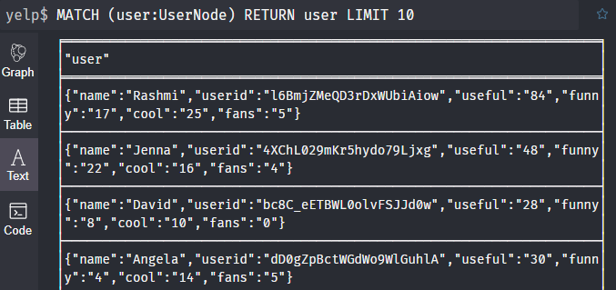


### 2-2
#### 题目
查询城市是Chandler的商家节点。
#### 解析

```sql
MATCH (business:BusinessNode {city: 'Chandler'})
RETURN business
```

### 2-3
#### 题目
查询reviewid是xkVveYJIL1Eiwl46cP_VBg对应的bussiness信息。
#### 解析

```sql
MATCH(:ReviewNode {reviewid:'xkVveYJIL1Eiwl46cP VBg'})-[:Reviewed]->(business:BusinessNode)
RETURN business
```


### 2-4
#### 题目
查询评价过businessid是5ykOWYZ44sUvu9qxD8rPeg商家的用户的名字和粉丝数。
#### 解析

```sql
MATCH (user:UserNode)-[:Review]->(:ReviewNode)
  -[:Reviewed]->(:BusinessNode {businessid: '5ykOWYZ44sUvu9qxD8rPeg'})
RETURN user.name, user.fans
```


### 2-5
#### 题目
查询被userid为0kSXMbNFo7mdwTPj4iQv9A的用户评论为5星的商家名称和地址。
#### 解析

```sql
MATCH (:UserNode {userid: '0kSXMbNFo7mdwTPj4iQv9A'})
  -[:Review]->(:ReviewNode {stars: '5.0'})
    -[:Reviewed]->(business:BusinessNode)
RETURN business.name, business.address
```


### 2-6
#### 题目
查询商家名及对应的星级和地址，按照星级降序排序（限制15条）。
#### 解析

```sql
MATCH (business:BusinessNode)
RETURN business.name, business.stars, business.address
ORDER BY business.stars DESC
LIMIT 15
```


### 2-7
#### 题目
使用where查询粉丝数大于100的用户的名字和粉丝数（限制10条）
#### 解析

```sql
MATCH (user:UserNode)
WHERE toInteger(user.fans) > 100
RETURN user.name, user.fans
LIMIT 10
```


### 2-8
#### 题目
查询businessid是5ykOWYZ44sUvu9qxD8rPeg商家包含的种类数,并使用PROFILE查看执行计划，进行说明
#### 解析

```sql
MATCH (:BusinessNode {businessid: '5ykOWYZ44sUvu9qxD8rPeg'})
  -[:IN_CATEGORY]->(c:CategoryNode)
RETURN COUNT(DISTINCT c)

PROFILE MATCH (:BusinessNode {businessid: '5ykOWYZ44sUvu9qxD8rPeg'})
  -[:IN_CATEGORY]->(c:CategoryNode)
RETURN COUNT(DISTINCT c)

> Cypher version: CYPHER 4.0, planner: COST, runtime: INTERPRETED. 385226 total db hits in 140 ms
```

查询计划图

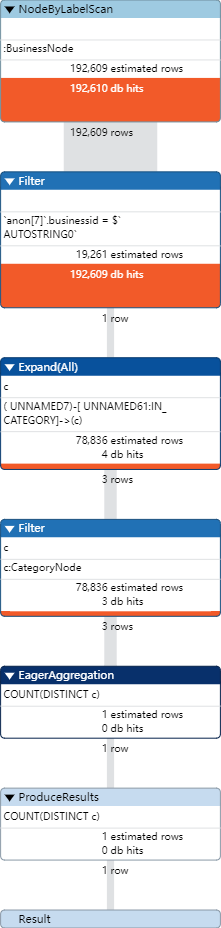


### 2-9
#### 题目
查询businessid是5ykOWYZ44sUvu9qxD8rPeg商家包含的种类,以list的形式返回。
#### 解析

```sql
MATCH (:BusinessNode {businessid: '5ykOWYZ44sUvu9qxD8rPeg'})
  -[:IN_CATEGORY]->(c:CategoryNode)
RETURN COLLECT(c.category)
```

是以list的形式返回
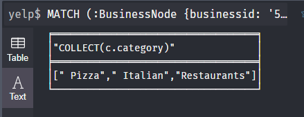


### 2-10
#### 题目
查询Victoria的朋友（直接相邻）分别有多少位朋友。(考察：使用with传递查询结果到后续的处理)
#### 解析

```sql
MATCH(:UserNode{name:'Victoria'})-[:HasFriend]->(friend)
WITH friend.name as friendsList, size((friend)-[:HasFriend]-()) as number0fFoFs
RETURN friendsList,number0fFoFs
```

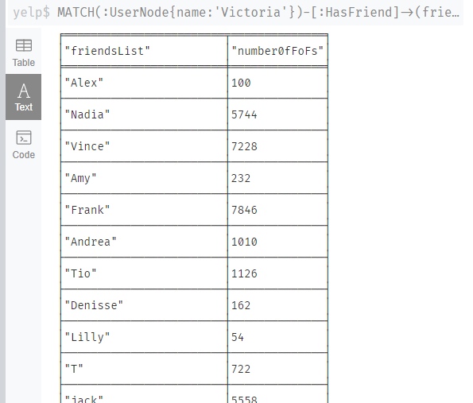


### 2-11
#### 题目
查询城市是Chandler的商家节点。

#### 解析
- 使用 MATCH 子句匹配类别为 Hot Pot 的 CategoryNode 节点和它们所对应的 BusinessNode 节点，并将匹配到的 BusinessNode 节点的 city 属性作为变量 cityName 传递到下一个子句。
- 使用 WITH 子句对每个城市进行分组，统计该城市中类别为 Hot Pot 的商家数量，并将城市名称和商家数量传递到下一个子句。
- 使用 ORDER BY 子句将商家数量按照降序排序，以便选择前 5 个数量最多的城市。
- 使用 RETURN 子句输出城市名称和对应的商家数量，并限制结果数量为前 5 条。

注意，这个查询语句中的 b.city 是用于选择 BusinessNode 节点的 city 属性，而不是输出结果中的城市名称。因此，我们需要使用 WITH 子句将 city 属性转换为一个变量，并将这个变量作为输出结果中的城市名称。

```sql
MATCH (b:BusinessNode)-[:IN_CATEGORY]->(:CategoryNode {category: 'Hot Pot'})
WITH b.city AS cityName, COUNT(*) AS numberOfBusiness
RETURN cityName, numberOfBusiness
ORDER BY numberOfBusiness DESC
```


### 2-12
#### 题目
查询商家名重复次数前10的商家名及其次数。

#### 解析
首先匹配所有的 BusinessNode 节点，并将每个节点的 name 属性作为变量 name 传递到下一个子句。然后使用 WITH 子句对每个商家名称进行分组，统计重复出现的次数，并将商家名称和出现次数传递到下一个子句。接着使用 WHERE 子句筛选出出现次数大于 1 的商家名称，以便选择重复出现的商家名称。最后使用输出商家名称和对应的出现次数，并按照出现次数降序排序，以便选择前 10 个重复出现次数最多的商家名称。

```sql
MATCH (b:BusinessNode)
WITH b.name AS name, COUNT(*) AS count
WHERE count > 1
RETURN name, count
ORDER BY count DESC
LIMIT 10
```
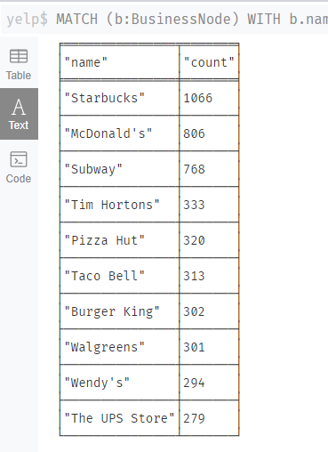

### 2-13
#### 题目
统计评价数大于4000的商家名热度（名字的重复的次数在所有的商家名中的占比），按照评价数量排序，返回热度和商家名和评价数。

#### 解析
首先筛选出评价数大于4000的商家，使用toInteger函数将business.reviewcount属性转换为整型。接着，使用WITH COUNT(DISTINCT business) AS cnt语句统计所有商家的数量，将数量保存到变量cnt中。然后，再次使用MATCH语句筛选评价数大于4000的商家，并在WITH子句中将这些商家的名字、评价数、以及前面统计得到的商家总数cnt传递给下一步操作。最后，使用WITH子句对商家名、热度（即名字的重复次数在所有商家名中的占比）和评价数进行处理，并使用RETURN语句返回结果。结果按照评价数降序排序，其中每行的内容依次为热度、商家名和评价数。

```sql
MATCH (business:BusinessNode)
WHERE toInteger(business.reviewcount) > 4000
WITH COUNT(DISTINCT business) AS cnt
MATCH (business:BusinessNode)
WHERE toInteger(business.reviewcount) > 4000
WITH business, COUNT(*) AS count, cnt
WITH business.name AS name, count, count*1.0/cnt AS popularity, business.reviewcount AS reviewcount
RETURN popularity, name, reviewcount
ORDER BY reviewcount DESC
```
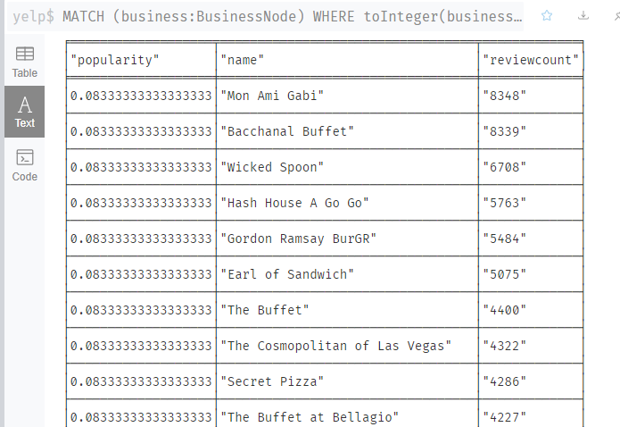


### 2-14
#### 题目
查询具有评分为5.0的Hot Pot类别的商铺所在城市。

#### 解析
通过MATCH语句匹配所有评分为5.0且分类为Hot Pot的商铺节点和Hot Pot类别节点，然后通过-[:IN_CATEGORY]->语句指定这两种节点之间的关系为"IN_CATEGORY"关系，表示商铺属于Hot Pot类别。最后通过RETURN语句返回去重后的商铺所在城市，即business.city。

```sql
MATCH (:UserNode)-[:Review]->(r:ReviewNode)
  -[:Reviewed]->(b:BusinessNode)
    -[:IN_CATEGORY]->(c:CategoryNode {category: 'Hot Pot'})
WHERE r.stars = '5.0'
RETURN DISTINCT b.city as city
```
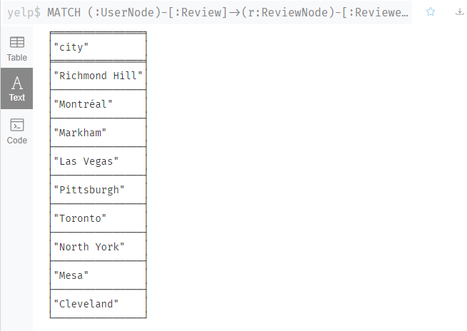


### 2-15
#### 题目
统计每个用户评价过的商家数量，按照数量降序排列，返回用户id，用户名和评价过的商家的数量（需要对商家去重）。

#### 解析
首先找到所有的UserNode节点，这些节点和BusinessNode节点通过Reviewed关系相连，并且这些BusinessNode节点和ReviewNode节点之间通过Review关系相连。然后将找到的节点按照user进行分组，并计算每个用户评价过的商家数量，将结果保存为count。

```sql
MATCH (user:UserNode)-[:Review]->(:ReviewNode)
  -[:Reviewed]->(b:BusinessNode)
WITH user, COUNT(DISTINCT b) AS count
RETURN user.userid, user.name, count
ORDER BY count DESC
LIMIT 10
```
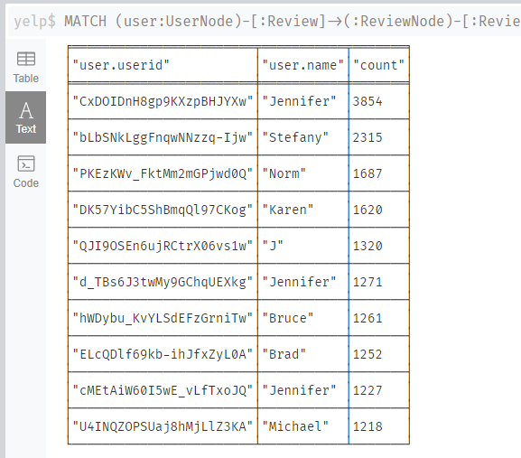


### 2-16
#### 题目
体会建立索引对查询带来的性能提升，但会导致插入，删除等操作变慢（需要额外维护索引代价）。
#### 解析
1. 首先为UserNode增加flag属性，由于Neo4j服务器的Java Heap空间不足，只为fans值大于3000的数据添加flag属性，值等于其fans值

```sql
MATCH (user:UserNode)
WHERE toInteger(user.fans) > 300
SET user.flag = user.fans
```

2. 对UserNode的flag属性执⾏查询（flag>300）

```sql
MATCH (user:UserNode)
WHERE toInteger(user.flag) > 300
RETURN user
```

3. 把所有的flag值改为8001（更新操作）
```sql
MATCH (user:UserNode)
WHERE toInteger(user.flag) > 300
SET user.flag = 8001
```

4. 删除（flag>8000），删除后查询一下看看，结果为空，删除成功

```sql
MATCH (user:UserNode)
WHERE user.flag > 8000
REMOVE user.flag
```

5. 重新执行操作1，然后在flg属性上建立索引
```sql
CREATE INDEX FOR (user:UserNode) ON (user.flag)

// 备注，查找索引名字并删除索引的方法
CALL db.indexes()
DROP INDEX `name with no quote`
```

6. 重复上述查询、修改、删除操作


### 2-17
#### 题目
查询与用户user1（userid: 0kSXMbNFo7mdwTPj4iQv9A) 不是朋友关系的用户中和user1评价过相同的商家的用户，返回用户名、共同评价的商家的数量，按照评价数量降序排序（查看该查询计划，了解该查询的执行计划及查询执行时间，并给出物理优化手段，以提高查询性能，通过优化前后的性能对比展现优化程度。）

#### 解析
首先，查询出u1评价过的商家列表，使用COLLECT函数对结果进行聚合，得到一个列表u1_businesses。然后，匹配所有评价过与u1相同商家的用户u2，并检查u2是否与u1有朋友关系（使用NOT操作符），将结果返回。返回结果中包括u1和u2的名称，以及二者共同评价商家的数量。最后按照共同评价商家数量进行降序排序。

```sql
MATCH (u1:UserNode {userid: '0kSXMbNFo7mdwTPj4iQv9A'})
  -[:Review]->(:ReviewNode)-[:Reviewed]->(b:BusinessNode)
WITH u1, COLLECT(DISTINCT b) AS u1_businesses
MATCH (u2:UserNode)-[:Review]->(:ReviewNode)-[:Reviewed]->(b:BusinessNode)
WHERE NOT (u1)-[:HasFriend]->(u2) AND NOT (u2)-[:HasFriend]->(u1) AND b IN u1_businesses
RETURN u1.name, u2.name, COUNT(b) AS sum
ORDER BY sum DESC
```
PROFILE查看执行计划后得到如下图
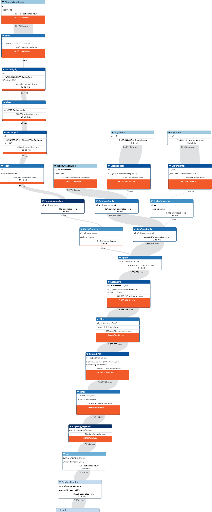
运行时间如下
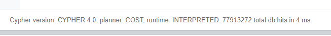

#### 优化
为UserNode的userid属性和BusinessNode的business_id属性创建索引，以加速节点的查找和匹配操作。
```sql
CREATE INDEX FOR (user:UserNode) ON (user.userid)
CREATE INDEX FOR (b:BusinessNode) ON (b.businessid)
```
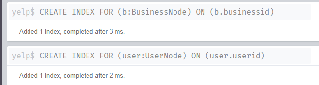

将子查询中的COLLECT操作改为使用节点标签进行聚合，以减少内存使用。
```sql
MATCH (u1:UserNode {userid: '0kSXMbNFo7mdwTPj4iQv9A'})
  -[:Review]->(:ReviewNode)-[:Reviewed]->(b:BusinessNode)
WITH u1, COLLECT(DISTINCT b.businessid) AS u1_businesses
MATCH (u2:UserNode)-[:Review]->(:ReviewNode)
  -[:Reviewed]->(b:BusinessNode)
WHERE NOT (u1)-[:HasFriend]->(u2)
  AND NOT (u2)-[:HasFriend]->(u1)
  AND b.businessid IN u1_businesses
RETURN u1.name, u2.name, COUNT(b.businessid) AS sum
ORDER BY sum DESC
```
重新PROFILE查看执行计划
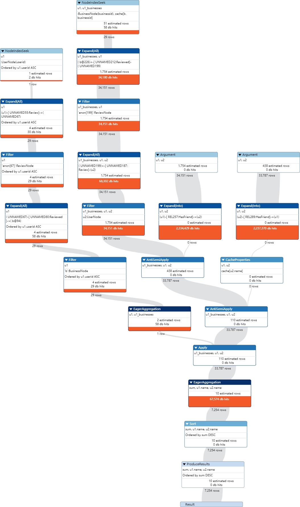
运行时间如下，可以看到比建立索引前短了特别多
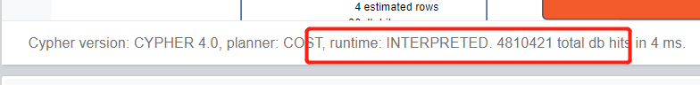

### 2-18
#### 题目
18.分别使用Neo4j和MongoDB查询review_id为Q1sbwvVQXV2734tPgoKj4Q对应的user信息，比较两者查询时间，指出Neo4j和MongoDB主要的适用场景。

#### 解析
##### Neo4j
代码如下
```sql
MATCH (user:UserNode)-[:Review]->(r:ReviewNode {reviewid: 'Q1sbwvVQXV2734tPgoKj4Q'})
RETURN user
```

##### MongoDB
代码如下
```js
var review_uid = db.review.findOne({"review_id": "Q1sbwvVQXV2734tPgoKj4Q"}).user_id
db.user.findOne({"user_id": review_uid}).explain()
```

##### 比较
- Neo4j：适用于复杂的图形结构数据查询，如社交网络、推荐系统、知识图谱等。由于其使用基于图论的查询语言Cypher，支持关系型数据的快速查询和分析。
- MongoDB：适用于海量非结构化或半结构化数据存储和查询，如日志、传感器数据、文档数据库等。由于其使用文档数据库模型，支持高效的数据插入和查询，并支持分布式数据库集群的横向扩展