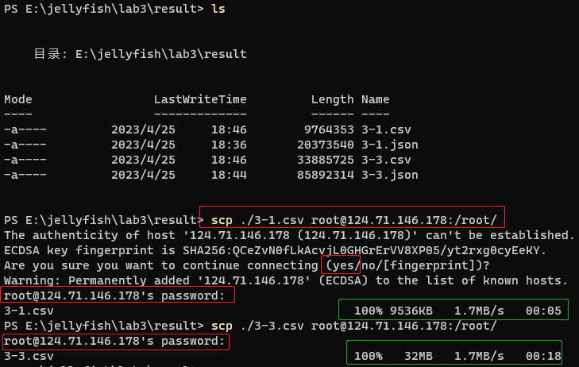
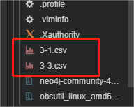
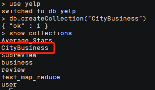
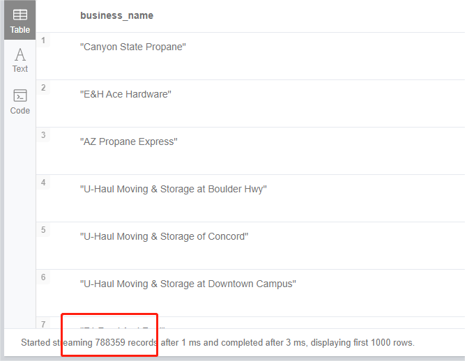
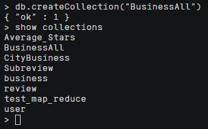
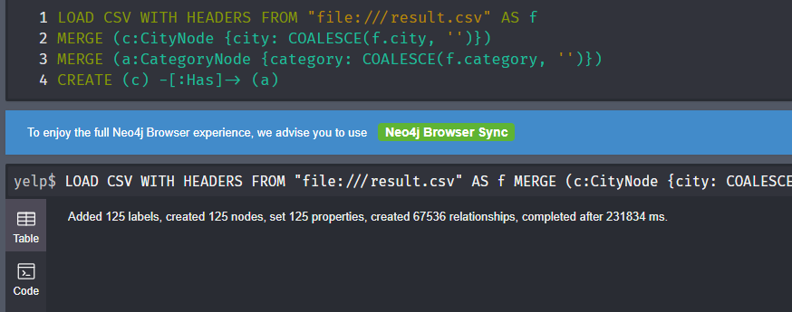
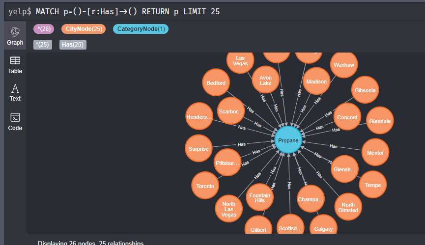

## 任务三：多数据库交互应用实验

### 3-1
#### 题目
使用Neo4j查找：找出包含的商家种类超过10类的城市（记得去重），并在Neo4j以表格形式输出满足以上条件的每个城市中的商家信息：城市，商家名称，商家地址。

#### 解析
```sql
MATCH (c:CityNode)<-[:IN_CITY]-(b:BusinessNode)-[:IN_CATEGORY]->(a:CategoryNode)
WITH c, count(DISTINCT a) AS category_count
WHERE category_count > 10
MATCH (c)<-[:IN_CITY]-(b:BusinessNode)
RETURN c.city AS city, b.name AS name, b.address AS address
```

### 3-2
#### 题目
将1得到的结果导入MongoDB，并使用该表格数据，统计其中所有出现的商家名及该商家名对应的出现次数，并按照出现次数降序排序:
(1) 使用aggregate和mapreduce两种方式实现
(2) 比较这两种方式的执行效率并分析其原因。

#### 解析
##### Neo4j结果导入MongoDB
1.将刚刚neo4j中的输出结果用csv格式下载到本地。打开终端，cd到刚刚csv保存的目录下，输入以下命令将数据导入到服务器上。

- 这里的3-1.csv是刚刚保存的输出结果的文件名
- root@124.71.146.178是服务器用户名和IP地址
- :/root/ 代表上传目标路径

```shell
scp ./3-1.csv root@124.71.146.178:/root/
```

运行命令后，输入服务器密码即可，如下



在服务器上可以看到root/下以有我们导入的数据



2.切换到mongoDB的yelp数据集并创建一个新的集合，这里叫做CityBusiness
```js
use yelp
db.createCollection("CityBusiness")
show collections
```



3.退出mongoDB，回到~，把数据导入到mongoDB中的yelp数据集的CityBusiness集合中。

```shell
mongoimport -d=yelp -c=CityBusiness --type=csv --headerline ./3-1.csv
```
运行后显示导入成功


进入mongoDB查询看看，可以查到数据


##### 数据统计
**1. Aggregate**
按照name字段对文档进行分组，使用`$sum`操作符对每组文档的数量进行求和，生成一个新的count字段。

```js
db.CityBusiness.aggregate([
  { $group: { _id: '$name', count: { $sum: 1 } } },
  { $sort: { count: -1 } }
])
```

**2. Mapreduce**

```js
db.CityBusiness.mapReduce(
  function() {
    emit(this.name, 1);
  },
  function(key, values) {
    return Array.sum(values);
  },
  {
    out: { inline: 1 },
    finalize: function(key, reducedValue) {
      return { count: reducedValue };
    }
  }
)
```

##### 比较分析
结果是aggregate方法特别快、无等待感，但是mapreduce要特别久，下图是mapreduce输出结果


分析如下
- 操作数据的过程中不需要频繁地读写磁盘，aggregate操作可以在内存中完成。相比之下，mapreduce 需要对所有输入数据进行读取和写入，对磁盘的操作比较频繁，效率相对较低。

- aggregate 支持多个操作符的串联使用，因此可以将多个操作合并在一起执行，减少操作次数和磁盘 I/O。而 mapreduce 的过程中，由于需要进行两个阶段的操作，会产生较多的数据中间输出和磁盘读写操作，导致效率相对较低。


### 3-3
#### 题目
在Neo4j中查找所有商家，要求返回商家的名字，所在城市、商铺类。
(1) 将查找结果导入MongoDB中实现对数据的去重（提示：使用aggregate，仅保留城市、商铺类型即可）
(2) 将去重后的结果导入Neo4j中的新库result中，完成（City-[Has]->Category）图谱的构建。

#### 解析
1.Neo4j数据库查询操作
```sql
MATCH (b:BusinessNode)-[:IN_CATEGORY]->(c:CategoryNode)
RETURN b.name AS business_name, b.city AS city, c.category AS category
```
可以看到结果条数



2.导入服务器和MongoDB操作不再赘述，请看本文档的3-2章节。这里新的集合名叫做BusinessAll




3.去重操作
使用`$group`将BusinessAll集合中所有的文档按照city和category字段进行分组，然后用`$forEach`将前面结果中的数据插入到BusiDistinct集合中；BusiDistinct集合中的所有文档，即为不重复的城市和类别组合。

```js
db.createCollection("BusiDistinct")
db.BusinessAll.aggregate([
  { $group: { _id: { city: '$city', category: '$category' } } }
]).forEach((item) => { db.BusiDistinct.insert( item._id ) } )
```
查看结果


4.导出BusiDistinct集合的内容为csv文件
```shell
mongoexport -d yelp -c BusiDistinct --type=csv --fields city,category --out result.csv
```


5.上一步导出后，result.csv文件位于~路径下，用cp命令把他放到neo4j安装目录的的import路径下

```shell
cd ~/neo4j-community-4.0.9/import
cp /root/result.csv ./
```

6.在neo4j网页数据库中输入以下命令，要对空值做处理

```sql
LOAD CSV WITH HEADERS FROM "file:///result.csv" AS f
MERGE (c:CityNode {city: COALESCE(f.city, "")})
MERGE (a:CategoryNode {category: COALESCE(f.category, "")})
CREATE (c) -[:Has]-> (a)
```
结果如下



查看一下图谱


