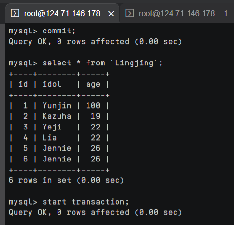
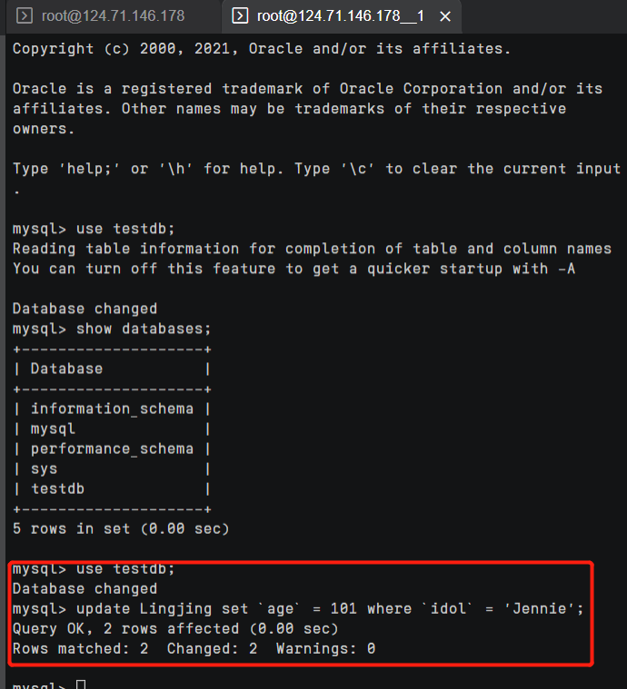
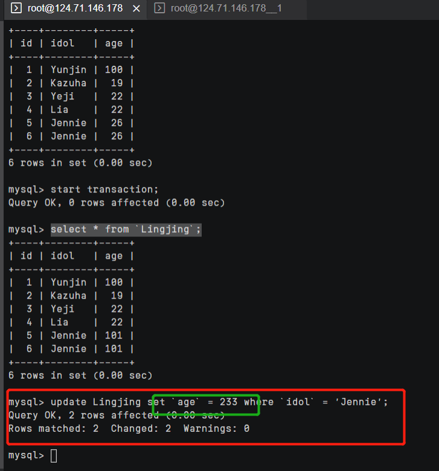
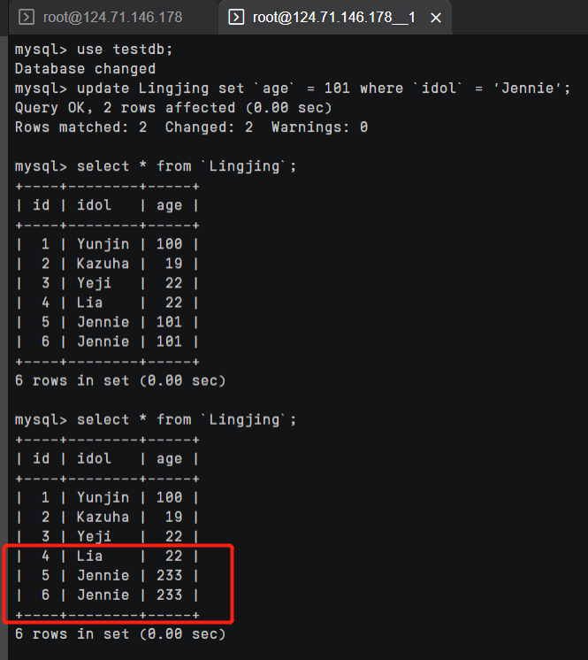
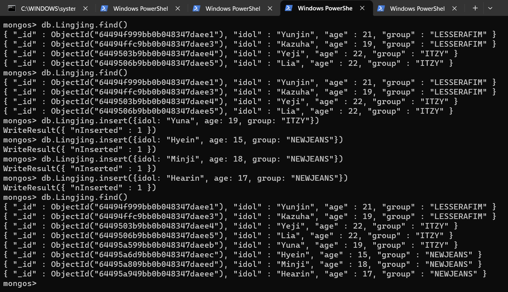
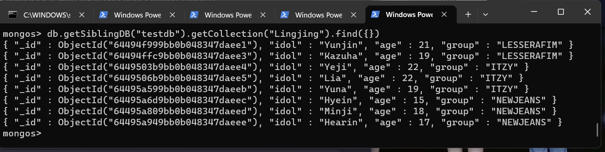
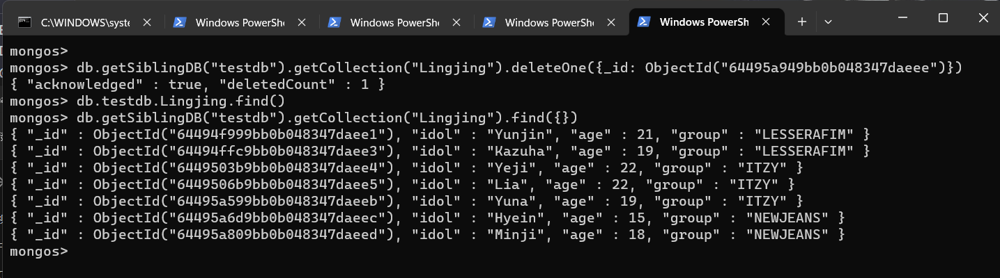
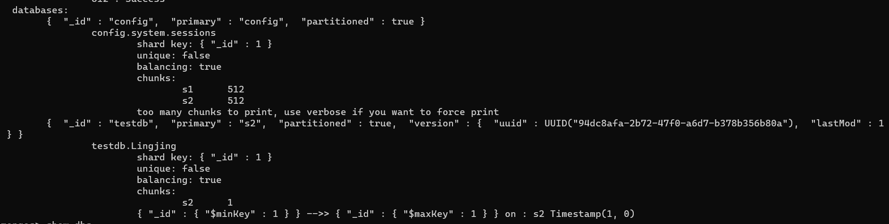

## 任务四：不同类型数据库MVCC多版本并发控制对比实验

### MySQL
创建一个叫做testdb的数据库
```sql
create database testdb
use testdb
```

在testdb数据库中创建一个新表以用于后续实验，设置engine=InnoDB;
```sql
create table `Lingjing` (
  `id` int(11) not null,
  `idol` varchar(20) not null,
  `age` int(5) not null,
  primary key(`id`)
) engine=InnoDB;
```

设置事务隔离等级为可重复读
```sql
set session transaction isolation level repeatable read;
```

向表中插入一些数据
```sql
insert into Lingjing (`id`, `idol`, `age`) values (1, 'Yunjin', 100);
insert into Lingjing (`id`, `idol`, `age`) values (2, 'Kazuha', 19);
insert into Lingjing (`id`, `idol`, `age`) values (3, 'Yeji', 22);
insert into Lingjing (`id`, `idol`, `age`) values (4, 'Lia', 22);
insert into Lingjing (`id`, `idol`, `age`) values (5, 'Jennie', 26);
insert into Lingjing (`id`, `idol`, `age`) values (6, 'Jennie', 26);
```



开始一个事务
```sql
start transaction;
```

再开一个终端，修改`idol = Jnenie`的数据的`age`为101



在原来的终端里查询数据，发现已经可以查询到修改的数据，如下所示。


在原来的终端里修改数据，修改`idol = Jnenie`的数据的`age`为203
```sql
update Lingjing set `age` = 233 where `idol` = 'Jennie';
```



先不要commit，在另一个终端中查看一下表中的数据，读到的是原来的数据101


回到原来的终端中进行commit，到另一个终端中查询，已经可以查到修改后的数据。



### MongoDB

分片教程大部分按助教的文档来就行，以下是修改及注意点：
- MongoDB 4.4版本安装，只要把软件源list文件里所有的3.2换成4.4就行
- `su - mongodb` 失败没有得到预期结果的话先执行 `su root` 就行
- 初始化replica set的时候实验文档里的shard1写成shard2了，端口号也要改成27017
- 使用mongos时，端口号是前面设置的30000不是20000，执行addshard时字符串里的逗号之间不能有空格，IP换成自己的三个 （教程后两个ip是一样的，它写错了）。

使用mongos，连接上两个服务器，在第一个连接终端里创建testdb数据，并创建一个集合，创建完后插入一些数据，效果如下



在另一个终端窗口中查询数据

```js
db.getSiblingDB("testdb").getCollection("Lingjing").find({});
```



删除一条数据

```js
db.getSiblingDB("testdb")
  .getCollection("Lingjing")
    .deleteOne({
      _id: ObjectId("64495a949bb0b048347daeee")
    })
```



回到第一个终端窗口中查询数据，可以发现已经删除成功


### 不同之处

MySQL的MVCC是通过在每行数据后面存储版本号来实现的。每次修改数据时，MySQL会将新的版本号与修改后的数据一起写入数据库，保留旧版本的数据。这样，在并发读取数据时，MySQL可以使用版本号来判断读取哪个版本的数据，从而实现MVCC。

MongoDB的MVCC是通过在每个文档上保留历史版本来实现的。MongoDB中的文档是一组键值对，每个文档都有一个唯一的_id字段作为主键。在MongoDB中，每个文档都会维护一个“版本号”，用来表示该文档最近一次被修改的版本。


